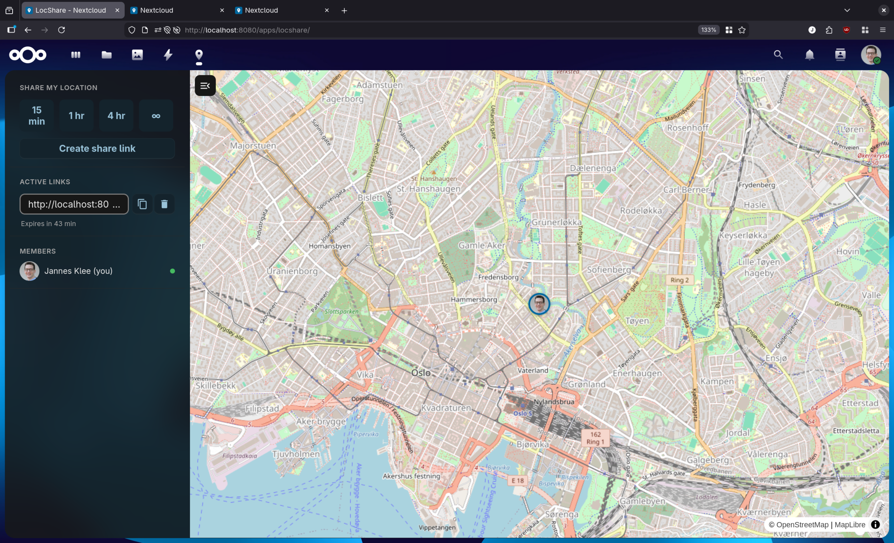
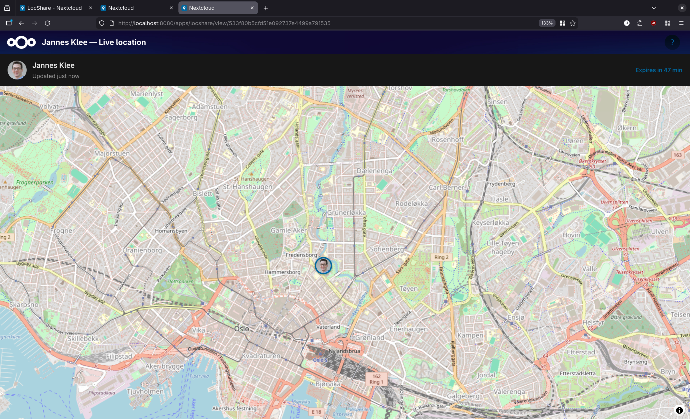

# Wepwawet

> **Status:** Pre-1.0, actively developed. Core features below work end-to-end; not yet published to any app store. Expect some rough edges as it heads toward a first stable release.

A minimal Nextcloud app for live location sharing — the self-hosted alternative to WhatsApp Live Location / Google Family Sharing. No third-party services: map tiles come straight from OpenStreetMap, and everything else — accounts, groups, positions — stays on your own Nextcloud.

## Screenshots




## Features

- **Groups** — invite family/friends into a group via a link; everyone in it can see everyone else's live position on a shared map. Create multiple groups, toggle your visibility per group, remove members, leave a group.
- **Timed share links** — for a quick one-off share instead of a group: create a link (15 min / 1 hr / 4 hr / no expiry), send it to anyone. They open it in a browser, no account needed, and watch your position on a live map until it expires.
- **Guests** — anyone with a group's invite link can join as a guest (just a name, no Nextcloud account) and both share their own position *and* see the rest of the group on a map, from a browser or the companion app.
- **Companion mobile app** *(not yet available as a download — build from source)* — a React Native app (Android + iOS) for reliable background location sharing, since browser-based background GPS is limited, especially on iOS. Supports both logged-in Nextcloud accounts and guest mode (join one or more groups by pasting an invite link). See [Companion app](#companion-app-not-yet-released) below.

## Requirements

- Nextcloud 30–34

## Installation

Place the `wepwawet` folder in your Nextcloud `apps/` (or `custom_apps/`) directory and enable it:

```bash
php occ app:enable wepwawet
php occ maintenance:repair
```

Not yet available on the Nextcloud App Store — that's in progress (see `docs/app-store-release.md`).

## Development

```bash
npm ci
npm run dev        # watch mode
npm run build      # production build
```

Docker dev environment:

```bash
docker compose -f docker-compose.dev.yml up -d
docker exec --user www-data wepwawet-dev php occ app:enable wepwawet
```

Access at http://localhost:8080 (admin / admin123). See `docs/manual-testing.md` for the full manual test workflow and `docs/dev-notes.md` for non-obvious bugs/gotchas already root-caused.

## Mobile

**Browser (PWA):** log into your Nextcloud instance and navigate to Wepwawet — Android (Chrome) and iOS (Safari) will offer an install-to-home-screen prompt automatically; other browsers have an "Add to Home Screen" option in the menu. Good for quick, foreground sharing.

## Companion app (not yet released)

A native Android/iOS app lives in `companion/` (React Native + Expo), for reliable background sharing that a browser tab can't provide. It supports two modes, chosen at setup:

- **Nextcloud login** — sign in with your server URL + username/app password, manage your groups and timed share links, share your position in the background.
- **Guest** — paste one or more invite links to join groups without an account, see the rest of each group on a map.

Verified working end-to-end (including background location) on Android via emulator and native builds; iOS is unbuilt/untested so far. Not yet published to any app store — build from source for now:

```bash
cd companion
npm ci
npx expo run:android   # or run:ios
```

See `docs/dev-notes.md` for the Android dev environment setup (emulator, Metro, common gotchas) and `docs/manual-testing.md` for the manual test workflow.

## License

[AGPL-3.0](LICENSE) — the same license used by Nextcloud itself. Covers the whole repository, including the companion app.
